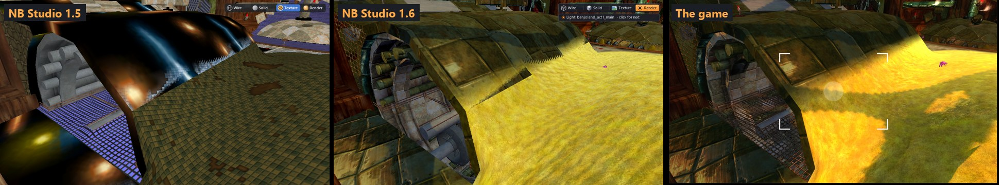
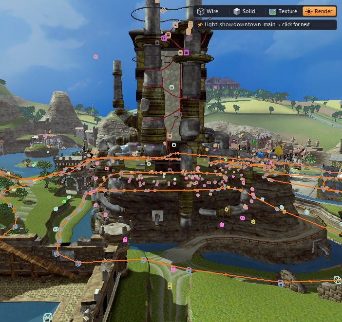
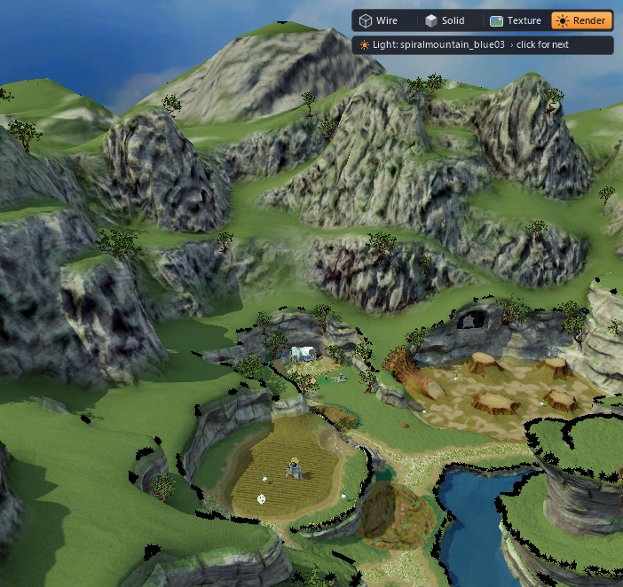
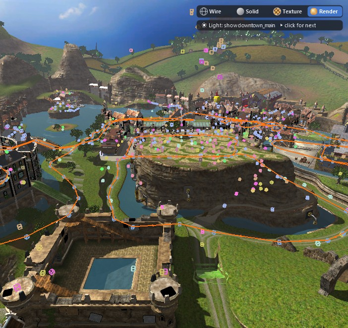
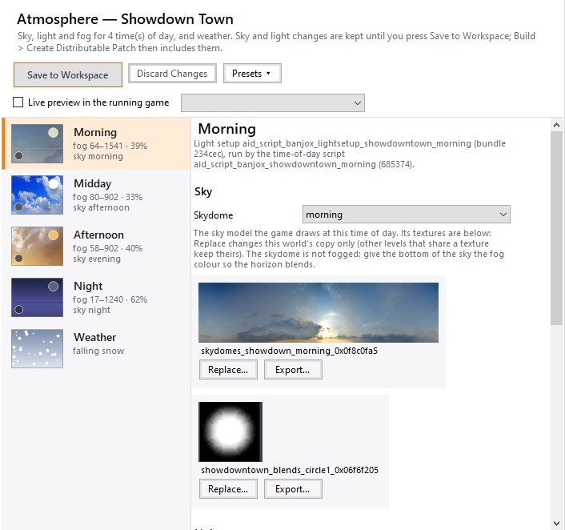
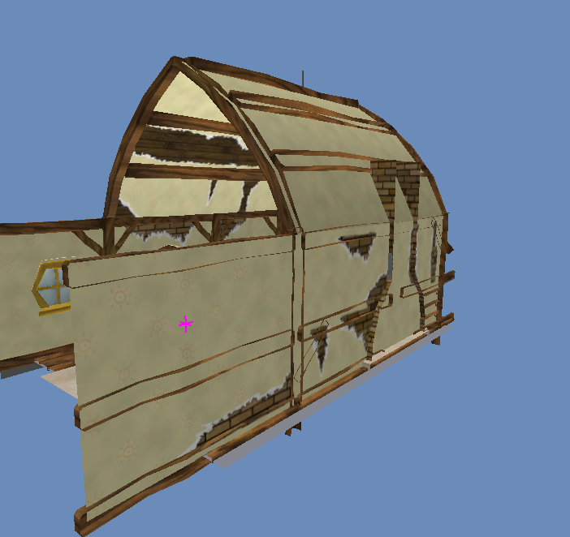
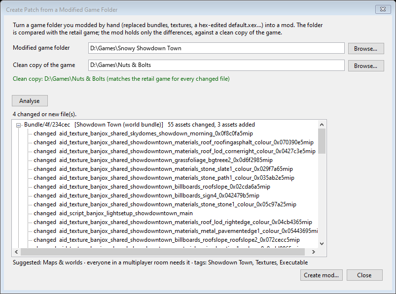
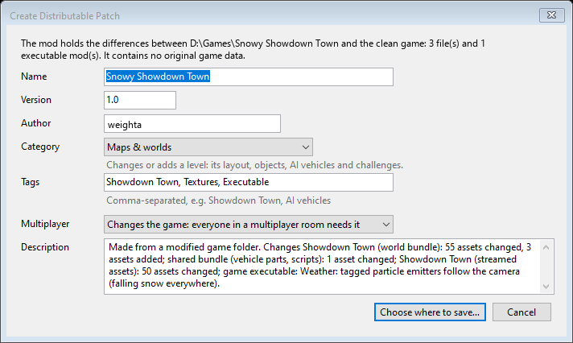
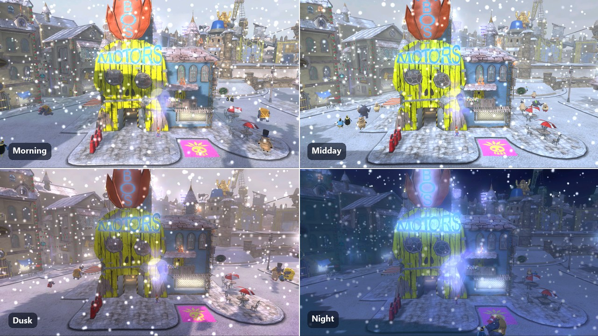
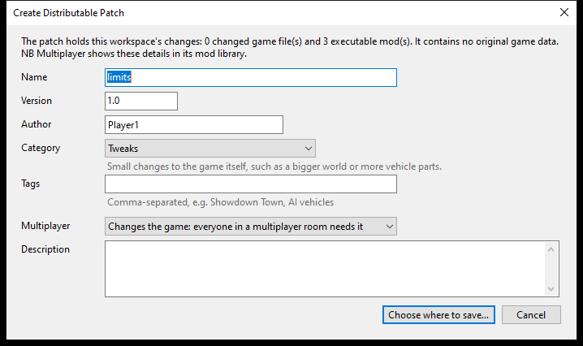

<p align="center">
  
</p>

<p align="center">
  <b>A world editor and modding toolkit for <i>Banjo-Kazooie: Nuts &amp; Bolts</i> (Xbox 360).</b><br>
  Open the game's worlds in 3D, move and replace scenery, swap textures, import models and new vehicle parts, add AI
  vehicles and routes, edit text, audio and video, and turn your changes into mods: small patches with a name, version
  and category that anyone can apply to their own copy, or combine and play online with friends in
  <a href="https://github.com/weighta/NB-Multiplayer">NB Multiplayer</a>.
</p>

<p align="center">
  
  
  
  
</p>

<p align="center">
  <a href="../../releases/latest"></a>
  <a href="src"></a>
</p>

<p align="center">
  
</p>
<p align="center"><i>The start page: a different photo from the game every time (here a custom flying vehicle by the
Space Needle of the Seattle mod). First time? NB Studio offers a 2-minute tour that explains every part of the window.</i></p>

---

## Contents

- [What it does](#what-it-does)
- [Screenshots](#screenshots)
- [Installation](#installation)
- [Tutorial: your first mod](#tutorial-your-first-mod)
- [How the tool works](#how-the-tool-works)
- [Research: the game's file formats](#research-the-games-file-formats)
- [Building from source](#building-from-source)
- [Related: NB Multiplayer](#related-nb-multiplayer)
- [Credits and legal](#credits-and-legal)

---

## What it does

| Area | What you can do |
|---|---|
| **Worlds** | Open every world and Act (Showdown Town, Nutty Acres, LOGBOX 720, Banjoland, Terrarium of Terror, Spiral Mountain, World of Sports, the test track...) with terrain, scenery, markers, AI paths and collision, and every object the game places with a marker drawn with its real model: L.O.G.'s palace, the Jiggy bank, Jig-o-vends, cranes, doors, crates, notes, characters and act vehicles (*View > Objects at Markers*). Select, move, rotate, scale, duplicate and delete objects. |
| **Undo, copy and paste** | **Ctrl+C / Ctrl+X / Ctrl+V** copy, cut and paste objects (a paste lands where the mouse points), **Del** deletes. **Ctrl+Z / Ctrl+Y** (or the toolbar buttons) undo and redo any change: moving, rotating and scaling, path links, and everything that writes the game files (model import, duplicate, delete, collision import, tag, atmosphere and texture saves). The Edit menu names the step. *File > Settings* sets how many steps are kept. |
| **Models** | Preview any model in 3D, export to OBJ or FBX (with skeleton and skin for characters), import OBJ/FBX geometry to replace scenery, build new scenery from imported models. |
| **Textures** | Decode all 14,049 textures (DXT1/3/5, DXN, CTX1, ARGB, cube and volume maps), browse a model's or world's textures in the texture library, export PNG, replace with your own image. |
| **Collision** | View and import world collision (Havok 5.5 extended meshes); box collision for imported scenery. Right-click > *Show Collision of Selection* draws the selected object's own collision as a wireframe; the **Collision** button by the view modes shows it for everything in the scene. |
| **Markers & paths** | Edit actor spawns, pickups, volumes, script triggers and AI path routes (the race paths the computer drivers follow), and add AI vehicles that drive your own routes. Path lines follow a node while you drag it, and characters walk your edited routes in game. |
| **Characters' dialogue** | Click a character and the *Dialogue* tab lists their lines (any language) to edit and save. |
| **Source maps (.vmf)** | *Tools > Import Source Map (.vmf)*: turn a Hammer map into playable Showdown Town geometry: brushes, displacements and collision, the map's own textures from your Source game, lights baked into lightmaps, the 3D skybox left out and tool textures (nodraw, clip...) hidden. Props are optional. |
| **Vehicle parts** | Part Importer: build new garage parts (model, physics, stats, attach points, garage tier dialogs). |
| **Text, audio, video** | Edit in-game text in all languages, replace music and sound effects (XWB banks), replace videos. |
| **Executable mods** | Toggle researched game-code changes (vehicles and Change Vehicle in town, destructible town vehicles, 2000-part vehicles, bigger world and garage, longer draw distance, all parts unlocked, debug menus...) as Xenia patches or baked into the executable. |
| **For beginners** | A guided tour on the first start (and from *Help > Take the Tour*): it spotlights each part of the window and explains it in plain words, then walks you through your first mod in 5 steps. Opening a workspace reopens the world you were last in; *File > Open Recent* lists the workspaces you used last. |
| **3D view** | Wireframe, Solid, Textured and **Rendered** views (switch in the corner of the 3D view). Every material is drawn with the game's own pixel shader, translated from the Xbox 360 shader code: metal, glass, reflections, texture tiling and colour come out as in the game. Rendered lights the world with the level's real lighting (sun, fill light, sky-and-ground ambient, shadows, fog), read from the level scripts; each world shows its own sky dome (also in Textured), and grass is placed the way the game places it (*View > Grass*). Blender-style editing: **G** move, **R** rotate, **T** scale, then **X/Y/Z** to lock an axis (shown as a coloured line), typed values; W A S D Q E fly. Select several objects (Shift/Ctrl-click, **B** or Ctrl+drag for a rectangle), **H** hides, **U** shows everything again. **Edit Collision** makes the world's collision selectable and editable (move, delete, add boxes and ramps). |
| **Atmosphere & weather** | The *Atmosphere* tab edits each time of day's sky, light and fog with colour pickers and sliders (with a live preview in a running game); *World > Weather* adds falling snow. Everything Snowy Showdown Town needed can be done in NB Studio. |
| **Testing** | **F5** plays the world you have open in Xenia right away (no title screen, menus or intro); Shift+F5 starts at the 3D view's camera, Ctrl+F5 at the title screen. Tweak a running game live (teleport, gravity, camera). |
| **Sharing** | Export a `.nbpatch` mod: a small differential patch with only your changes, plus its name, version, category (map, vehicle parts, gameplay, visuals, audio, tweak, co-op), tags and description. It contains no game data; others apply it to their own copy with one click (with backup and rollback) or add it to NB Multiplayer's mod library. |
| **Mods from modded folders** | Build > *Create Patch from a Modified Game Folder*: a game folder modded by hand becomes a mod. NB Studio compares it with the original game (size and SHA-256 of every retail file, shipped with the tool), shows what changed per file and asset (textures, models, markers, scripts, parts), recognises known executable tweaks in an edited `default.xex`, and fills in the category and tags. *Try it* starts the result in Xenia. |
| **Combining mods** | Mods that change the same bundle are merged asset by asset; real conflicts are named down to the asset. Mods can carry *world edits* that are replayed on top of other mods (Showdown Town co-op works on any town this way). World edits can copy objparams, models and animations between bundles (shared string pools are re-pointed), set any asset's values, add AI routes and script commands, and make joint-subset models; a mod's edits run in one batch. The **Character Select** mod of NB Multiplayer (17 playable characters) is made only of world edits. |
| **Xbox 360 photos** | Tools > *Xbox 360 Photo Viewer*: drop the photo packages your console saves with *Take Photo* (one or many) and the photo pops up: save it as PNG / JPEG / BMP, copy it (Ctrl+C) or drag it out. *Auto-extract* writes every dropped package's photo as a JPEG next to it. *Import Image into Package* (Ctrl+I) puts your own picture into a photo package (1280×720 JPEG and thumbnail, all package hashes recomputed); the game's Photo Album shows it. Dropping packages on `NBModStudio.exe` opens just the viewer. |
| **Command line** | `cli/NB.Cli.exe`: every format tool, patch building and applying, combining mods (`stack-check`, `stack-apply`), mods from modded folders (`game-verify`, `game-diff`, `patch-from-folder`), world edits (`ops-apply`), Xbox 360 photos (`photo-extract`, `photo-import`), the tick-box tweak mods, AI routes and vehicles, scripted Xenia tests. |

Everything is non-destructive: NB Studio works on a **workspace** (a copy of your game), never on your original files,
and keeps a history of every saved file.

## Screenshots

<p align="center">
  
</p>
<p align="center"><i>Clanker's tunnel in Banjoland. NB Studio 1.6 draws every material with the game's own shader code: the metal panels and sand now look like the game (right) instead of black with glowing blobs (left).</i></p>

<p align="center">
  
  
</p>
<p align="center"><i>L.O.G.'s palace and the town's other marker-placed objects, with the afternoon sky dome; Spiral Mountain with its rock and grass tiled as in the game.</i></p>

<p align="center">
  
  
</p>
<p align="center"><i>Showdown Town in the Rendered view (game lighting, sky and water), and the Atmosphere tab: sky, light and fog for every time of day, plus weather.</i></p>

<p align="center">
  
</p>
<p align="center"><i>Showdown Town in the world editor (terrain, scenery, markers and the AI race route).</i></p>

<p align="center">
  
</p>
<p align="center"><i>Banjo's House in the 3D view (NB Studio 1.1.1 decodes its instanced wall meshes correctly).</i></p>

<p align="center">
  
</p>
<p align="center"><i>The 3D view: every coloured box is a marker (pickups, actor spawns, triggers); the orange line is the AI path network.</i></p>

<p align="center">
  
  
</p>
<p align="center"><i>Editing LOGBOX 720 scenery with exact numeric transforms, and previewing a vehicle part model with its draw calls and vertex layouts.</i></p>

<p align="center">
  
</p>
<p align="center"><i>The texture library of a Showdown Town building: export, replace, or edit externally and re-apply.</i></p>

<p align="center">
  
  
</p>
<p align="center"><i>Create Patch from a Modified Game Folder: what a hand-modded folder changes, asset by asset, and the mod details NB Studio fills in from it.</i></p>

<p align="center">
  
  
</p>
<p align="center"><i>Snowy Showdown Town, the first official map mod (bundled with NB Multiplayer), made with these tools: snow textures, holly and bunting, camera-following snowfall and winter light, fog and skies. Recipe: <code>snow/build.sh</code>.</i></p>

## Installation

1. **Download** the latest `NB-Studio-x.y.z.zip` from the [Releases](../../releases) page and unzip it anywhere.
   (Or let [NB Multiplayer](https://github.com/weighta/NB-Multiplayer) do it: *Projects > Get NB Studio* installs NB
   Studio, keeps it up to date and lists your projects.)
2. You need **your own copy of the game**, extracted to a folder: the folder that contains `default.xex` and the
   `Bundle` folder (for example extracted from your disc image with *extract-xiso*). NB Studio never changes this folder.
3. Run **`NBModStudio.exe`**. Requirements: Windows 10/11 64-bit, a GPU with OpenGL 3.3.
4. For testing your mods, install **[Xenia Canary](https://github.com/xenia-canary/xenia-canary)** and point NB Studio
   to it the first time you press **Launch in Xenia (F5)**.

## Tutorial: your first mod

**1. Create a workspace.** On the start page choose *New Workspace from Game Directory...*, pick your game folder, then
an empty folder for the workspace. NB Studio copies the game there (a few minutes, about 7 GB) and indexes its 69,000
assets.

**2. Open a world.** The *Worlds* list shows every world and Act. Double-click **Showdown Town**. The 3D view opens:
right-drag to look around, WASD/QE to fly (Shift = fast), mouse wheel to dolly, middle-drag to pan, F to focus the selection.
The buttons in the top-right corner switch between Wireframe, Solid, Textured and Rendered (game lighting).

**3. Move something.** Click a piece of scenery (for example a café table near Mumbo's Motors). Press **G** and move
the mouse, then click to drop it; press **X**, **Y** or **Z** while moving to slide along one axis only, or type a number
(G, Z, 3.5, Enter moves it 3.5 units up). **R** rotates and **S** scales the same way. You can also drag the gizmo's
arrows (Move 1 / Rotate 2 / Scale 3), or type exact numbers in *Properties* and press *Apply*. Ctrl+Z undoes.

**4. Change a texture.** Right-click the object and choose *Textures... (view / export / replace)*. The texture library shows every texture the
model uses (*World > Texture Library* shows every texture of the world). Select one, *Export PNG*, paint over it, then *Replace...* with your image (tick *Only this model* to
leave other models that share the texture alone).

**5. Import a model.** Right-click scenery, *Import Model (replace geometry with OBJ/FBX)...*, pick an OBJ or FBX. It
replaces the object's model, importing the file's materials and textures. For collision use *Import Collision
(OBJ/FBX)...*.

**6. Save and test.** *Save World (Ctrl+S)* writes the changed bundle into your workspace. *Launch in Xenia (F5)*
starts the game from the workspace. *Tools > Test Mode: Skip Intro* makes a new game start straight in Showdown Town (about 40
seconds from launch).

**7. Share it.** *Build > Create Distributable Patch (.nbpatch)...* asks what the mod is (name, version, category,
tags, whether multiplayer players need it, description; the category starts as a guess from the files you changed) and
writes a `.nbpatch`. Other players apply it with *Build > Apply Patch to a Game Directory...* (it checks their files
first and keeps a backup; *Roll Back Patches* undoes it), or add it to the mod library of
[NB Multiplayer](https://github.com/weighta/NB-Multiplayer), combine it with other mods and tweaks, and play it online.

<p align="center"></p>

## How the tool works

```
NBModTool.sln
├── src/NB.Core         format library: xcompress, CAFF, bundles, textures, models, markers, scripts, collision,
│                       animations, text, audio, executable, workspace, patches, room server (multiplayer)
├── src/NB.Studio       the desktop editor (WinForms + OpenGL 3.3)
├── src/NB.Cli          command-line tools (over 100 commands: extraction, round-trip tests, batch edits)
└── src/NB.Multiplayer  the NB Multiplayer app (WPF), see the NB Multiplayer repository
docs/FORMATS.md         the file-format reference (summary below)
docs/STATUS.md          what is verified, what works, what is experimental
docs/research/          deep dives: garage, destruction, camera, debug menus, draw distance, animation codec...
research-tools/probe/   the Python scripts used to work the formats out
```

**Reading.** The game's 151 resident bundles (`Bundle/4f`, most xcompress/LZX-compressed) are decompressed in memory
into CAFF containers; streamed data (`Bundle/50`) is read from archives on demand. Every asset (69,000 of them) is
indexed by id, name, type and bundle; ids are a CRC-32 of the name, so a name always tells you where to look.

**Editing.** Every edit goes through the same path: parse the asset, change it, rebuild the CAFF (parts re-aligned,
relocation tables regenerated, checksum recomputed) and write the bundle back **uncompressed**. The game loads
uncompressed bundles fine, so no recompression is needed. Each save is recorded in the workspace's change log and history
(undo per file, revert to original).

**Sharing.** A `.nbpatch` holds binary deltas (COPY/ADD operations) of each changed file against the expanded
original, plus the SHA-256 of the expected source and result. Applying verifies both, so a patch only ever applies to the
exact game files it was made for, and never distributes game data. Its `patch.json` (format 2) also names the mod: `Id`,
`Version`, `Category` (`map`, `parts`, `gameplay`, `visual`, `audio`, `tweak`, `coop`), `Tags`, `Multiplayer`
(`world`, `cosmetic`, `coop`), `Requires` and `Conflicts`.

**Stacking.** `src/NB.Core/Project/ModStack.cs` applies several mods to one game copy (NB Multiplayer editions). Files
that several mods change are merged asset by asset (`ModMerge.cs`, three-way against the original: every changed asset is
taken from the mod that changed it; CAFF symbols and stream-archive entries alike); two mods changing the same asset
differently is a conflict, reported by name. Then every mod's **world edits** (`patch.json` format 3 `Ops`, see
`WorldOps.cs`: objparams-copy/set, asset-copy, ai-route, script-insert located by content) are replayed in recipe
order, and the executable mods are merged into one `default.xex` (a word two mods change must get the same value).
`NB.Cli stack-check / stack-apply / stack-explain` show what combines and why not. Game copies made of hard links are
never written through: a changed file always becomes a file of its own.

**Modded folders.** `src/NB.Core/Project/GameDiff.cs` compares a folder with `Data/retail_fingerprints.json` (path, size,
SHA-256 of the 1,981 retail files), finds a clean reference among candidate folders (it must have the retail version of
every changed file), lists changed/added/removed assets per bundle, and diffs the executable image word by word
(complete known executable mods are recognised; other words become one executable mod of the new patch).
`PatchPackage.BuildFromFolders` then writes an ordinary `.nbpatch`.

**Testing.** Xenia runs the workspace's game directory; executable mods are written as Xenia patch files (or baked into
`default.xex` for consoles that run unsigned code). The *Live (game)* tab attaches to a running Xenia and reads/writes
guest memory for teleporting, gravity and photo-mode camera control.

## Research: the game's file formats

Everything here was established against the unmodified game and is documented in full in
**[docs/FORMATS.md](docs/FORMATS.md)** (1,100+ lines), with deep dives in **[docs/research](docs/research)** and the
verification status of every feature in **[docs/STATUS.md](docs/STATUS.md)**. All values are big-endian (PowerPC).
Items are marked **[verified]** (checked on every file of that kind, or in Xenia), **[observed]** or **[unknown]**.

### Game directory and ids
| Path | Contents |
|---|---|
| `default.xex` | XEX2 executable (AES-encrypted, basic-compressed) |
| `Bundle/4f/<id>` | 151 resident bundles, one CAFF each (142 xcompress-compressed) |
| `Bundle/50/<id>` | 151 streaming archives (CAFFs and XACT wave banks loaded on demand) |
| `Debug/11`, `loctext/` | localised text (CAFF) |
| `Debug/36` | videos (WMV/ASF) |

An asset id is `typeByte << 24 | (CRC32(name) & 0xFFFFFF)` (reflected CRC-32, init `0xFFFFFFFF`, **no** final
inversion), where the name drops the `aid_<type>_` prefix. Bundles are named the same way: `banjox_common` is
`0x685374`, so its files are `Bundle/4f/685374` and `Bundle/50/685374`. Over 45 asset type bytes are mapped (texture
01, anim 02, model 04, havok 05, marker 0D, script 19, objparams 1F, challenge 3D...).

### Containers
* **xcompress `0x0FF512ED`**: LZX blocks (what `xbdecompress` undoes); decoded natively by NB.Core.
* **CAFF**: header with checksum, symbol table (asset names), parts grouped in sections (`.data`, `.gpu`, `.stream`,
  `.texturegpu`, `.gpucached`...), and a relocation table listing every pointer (pointers are stored as offsets into
  the target part). Rebuilding regenerates all of it: **1,756/1,756 files round-trip byte-identically**.
  Each bundle has a `manifest` asset listing (asset id, ordinal) pairs and the **dependency bundles**; the game finds
  assets only through the manifest, and a level's bundle pulls in its world through these dependencies.
* **Xbox 360 STFS packages** (`CON ` / `LIVE` / `PIRS`, the console's save, photo and download containers): metadata
  (display name, title and profile ids, thumbnail), file table, 4 KB blocks with SHA-1 hash tables. Read and rewritten
  (header hash, top hash, block hashes and chains recomputed; single-level packages); the console signature needs a
  resign (Horizon / Velocity) for a real console. A Nuts & Bolts photo is one file in such a package: a 32-byte game
  header (owner XUID at +0x10: the Photo Album lists only the playing profile's photos) and a 1280×720 JPEG.
* **Streaming archive `0x438CB47C`** (Bundle/50): entry table (asset id, offset, size) and dependencies; **151/151
  round-trip**.

### Textures **[verified on all 14,049]**
The CPU part holds the XDK `D3DFORMAT` (GPU format, endian swap, tiled bit), kind (2D, cube, multi-frame, volume),
size, level count and pointers to the GPU data. A texture is usually two assets: `...mip` (resident, levels 1..n) and
`...top` (streamed from Bundle/50, level 0). Formats in use: DXT1 (9,382), DXN (2,141), DXT3, CTX1, DXT5, 8-bit and
ARGB8888. Tiled data uses the Xbox 360 32×32-block macro tiles with 4 KB-aligned levels and a packed mip tail; linear
data pads rows to 256 bytes. DXN and CTX1 are two-channel normal maps. Replacement writes both the `mip` and the `top`.

### Models
`.data` begins with a chunk table of `(id, pointer)` pairs:
* **Chunk 2: nodes.** Transforms and parents (68 bytes each). In characters they bind skin; in worlds they are the
  scenery placements.
* **Chunk 12: scenery instances.** Each references a model by id, with a 0x144-byte record (name like
  `|REFERENCE_crate1|`), a world matrix and position. Moving scenery means editing these.
* **Render resources.** Vertex and index buffers (`.gpu`), shader patch lists into the bundle's shared `pool` asset,
  and a **command stream** (`.stream`) of draw commands: set shaders, bind vertex buffer, bind textures (into the
  model's texture table), constants, draw indexed, with LOD levels.
* **Vertex layout** is not stored with the mesh: it is read from the *vfetch* instructions of the vertex shader
  microcode in the pool (position float3/half4, normals 10:10:10:2, half2 UVs, skin indices/weights...).
* **Skeleton and skinning [verified in Blender]**: the `pose` object (52 bytes per joint: translation, bind pose,
  quaternion, parent/child/sibling/mirror links). Banjo has 175 joints, Mumbo 127, Grunty 119.
* **Animations [decoded, all 5,911]**: `QUAT_BITSTREAM`/`BITSTREAM` keyframe codec (per-channel base and bit width,
  LSB-first bit reading, w reconstructed). NB Studio exports to FBX and re-encodes edited animations.

### Markers **[26,943 records parse exactly]**
`aid_marker_*` assets hold every placed thing that is not scenery: actor spawns, pickups and indicators, volumes,
script triggers, gated collectables, path nodes... Records have a fixed size per type:
```
+0x00 u32 size   +0x04 u16 type   +0x06 u16 index   +0x08..0x13 [flags/links]
+0x14 float3 position   +0x20 float3 rotation (radians)   +0x2C float scale
+0x30... type-specific payload: asset ids (objparams 0x1F..., scripts 0x19...), enum strings
```
**Path nodes** (type 22) link to the next node through the u16 at +8; Showdown Town's AI route is 331 nodes along the
roads. Worlds load the world's own marker set plus one set per Act (`aid_marker_<world>_act<N>_main`).

### Scripts, levels and objects
* **Scripts** (`aid_script_*`): a header and a flat list of fixed-size commands `(size, opcode, args)`, no pointers,
  so commands can be added or removed (702/702 parse). Known opcodes include load level geometry (0x01), load marker
  sets (0x4E), skydome (0x2C), run sub-script (0x52/0x5A), set game flag (0x48), start challenge (0x60) and go to level
  (0x86). The script header names the bundle a level loads.
* **Objparams** (type 0x1F) store actor and vehicle-block parameters (layouts inferred from all 1,810 assets).
* **Vehicles** (type 0x00): a header plus one 0x24-byte record per block (grid position, category, part objparams id,
  rotation, paint, action button), all 275 parse exactly.

### Collision **[decoded]**
`aid_havok_*` wraps a **Havok 5.5.0-r1 binary packfile**; world collision is an extended mesh whose index and vertex
buffers are stored next to the packfile (Showdown Town: 67,576 triangles in one subpart, 367,474 overall). NB Studio
draws it and can import new collision meshes.

### Executable
`default.xex` decrypts with the retail key to a PE image. Researched code locations power the *Executable mods* list:
vehicles in town, debug menus and recovered parts (see `docs/research`), the co-op hooks, and *snow follows the camera*
(the GPU particle update copies node +0xA0 into the emitter at 0x82226ECC; a code cave writes the camera position there
for particle records tagged at +0x180, see `snow/research/fx/REPORT.md`).

### Light, fog and sky **[verified in Xenia]**
Showdown Town's four times of day (`aid_script_banjox_showdowntown_{morning,midday,afternoon,night}` in 685374) pick a
skydome (op 0x2C) and run a light setup in the town bundle (`aid_script_banjox_lightsetup_showdowntown_*`): ambient
(+0x08), sun colour (+0x0C), sun intensity (+0x1C), fog start/end/max (+0x50/+0x54/+0x58) and fog colour (+0x68). Details:
`snow/research/light/REPORT.md`.

### Runtime: vehicles and physics **[verified in Xenia, used by Showdown Town co-op]**
Guest addresses in the running game (big-endian floats), as read and written by `src/NB.Core/Live/CoopSync.cs`:

| What | Where |
|---|---|
| Player position | `[0x82FAC7AC] + 0xCB0` (x, y, z) |
| Vehicle object | vtable `0x82FB7F78`; blueprint id `+0x18A4`; spawn link `+0x8B8`; position `+0x50`; blocks `+0x1488`/`+0x148C` (0xB0 bytes each) |
| Vehicle rigid body | a whole vehicle is **one** Havok rigid body: `[vehicle + 0x7C0]` |
| Motion state (body + 0x110) | position `+0x00`; 3×3 rotation (columns) `-0x30`; centres of mass `+0x10`/`+0x20`; rotation quaternions (x,y,z,w) `+0x30`/`+0x40`; linear velocity `+0x90`; angular velocity `+0xA0` |

Writing the linear and angular velocity every frame steers a vehicle physically (it still collides and can be bumped);
moving all three positions (`+0x00`, `+0x10`, `+0x20`) together teleports it. The co-op edition itself is built by
[`coop/build.sh`](coop/build.sh): three AI "puppet" trolleys on the town's road loop
([`coop/town_route.txt`](coop/town_route.txt)) plus the town executable mods.

## Building from source

Requirements: Windows 10/11, the [.NET 9 SDK](https://dotnet.microsoft.com/download).

```bash
git clone https://github.com/weighta/NB-Studio-Banjo-Kazooie-Nuts-and-Bolts-World-Editor-.git
cd NB-Studio-Banjo-Kazooie-Nuts-and-Bolts-World-Editor-
dotnet build NBModTool.sln -c Release
```

The editor is `src/NB.Studio/bin/Release/net9.0-windows/NBModStudio.exe`, and the command-line tool is
`src/NB.Cli/bin/Release/net9.0-windows/NB.Cli.exe` (run it without arguments for the command list).

| Folder | What it is |
|---|---|
| `src/NB.Core` | The shared library: every game file format (CAFF bundles, xcompress, textures, models, markers, scripts, Havok collision, XEX), workspaces, patches and mod merging, executable mods, the room server and co-op sync |
| `src/NB.Multiplayer` | NB Multiplayer (WPF): rooms, Steam, editions, mod library, co-op, Character Select |
| `src/NB.Studio` | NB Studio (WinForms + OpenGL): the world editor |
| `src/NB.Cli` | `NB.Cli.exe`, the command-line tool used by the build scripts and tests |
| `renut-nb/` | NB's mod layer for [reNut](https://github.com/masterspike52/reNut) (the game recompiled to native PC code): NB Multiplayer's *Launch with reNut* option uses a reNut built with it |
| `coop/`, `charsel/`, `snow/` | Recipes that rebuild the bundled mods from your own copy of the game (`sh coop/build.sh`, `sh charsel/build.sh`, `sh snow/build.sh`; they need NB.Cli built in Release and Python). Set `NB_GAME` to your untouched game folder. Their output in `*/dist/` is bundled into NB Multiplayer when present. |
| `research-tools/`, `docs/` | The Python probes used to work out the file formats, and the format documentation |

## Related: NB Multiplayer

Play Nuts & Bolts online and in Showdown Town co-op with friends, including games modded with NB Studio:
**[weighta/NB-Multiplayer](https://github.com/weighta/NB-Multiplayer)**. It keeps a mod library where your mods are
listed by category and combined into editions, installs and updates NB Studio, and lists your projects. Its app is built from `src/NB.Multiplayer` in
this repository. It also lists your NB Studio projects (NB Studio records every project it opens in
`%APPDATA%\NBModTool\projects.json`), opens them here, and turns them into mods for its mod library.

## Credits and legal

* Created by **weighta**.
* Texture tiling follows the [Xenia](https://github.com/xenia-project/xenia) project's documentation of the Xbox 360
  GPU; audio decoding uses [vgmstream](https://github.com/vgmstream/vgmstream).
* NB Studio is licensed under the [MIT license](LICENSE).
* *Banjo-Kazooie: Nuts & Bolts* is © Microsoft and Rare. This is an unofficial fan project, not affiliated with or
  endorsed by them. It contains no game data; you need your own copy of the game.
