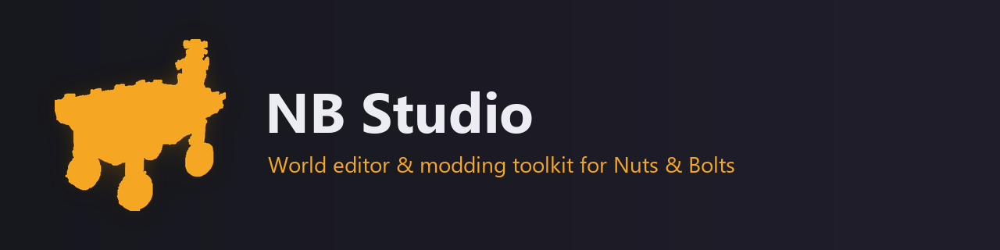
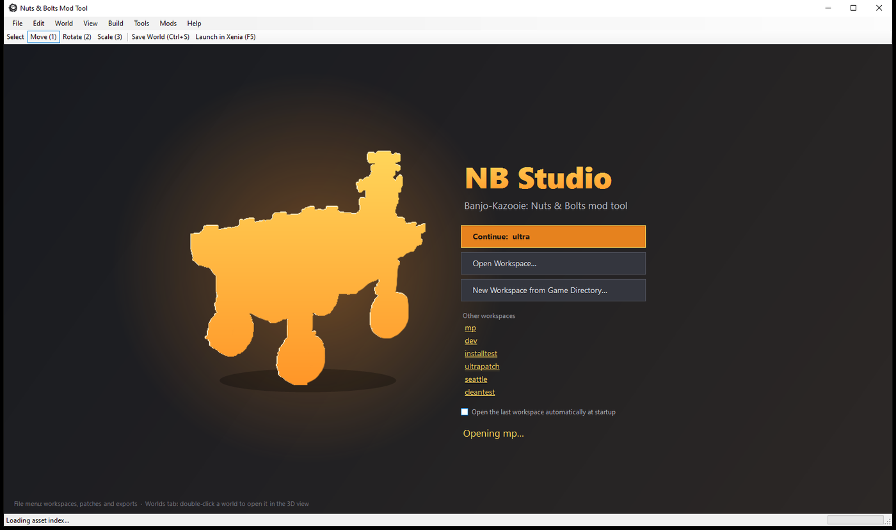
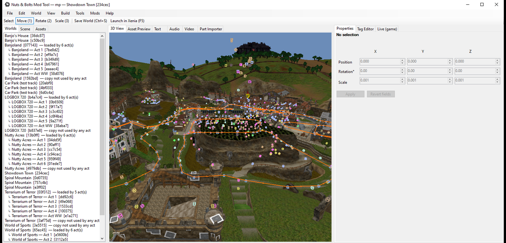
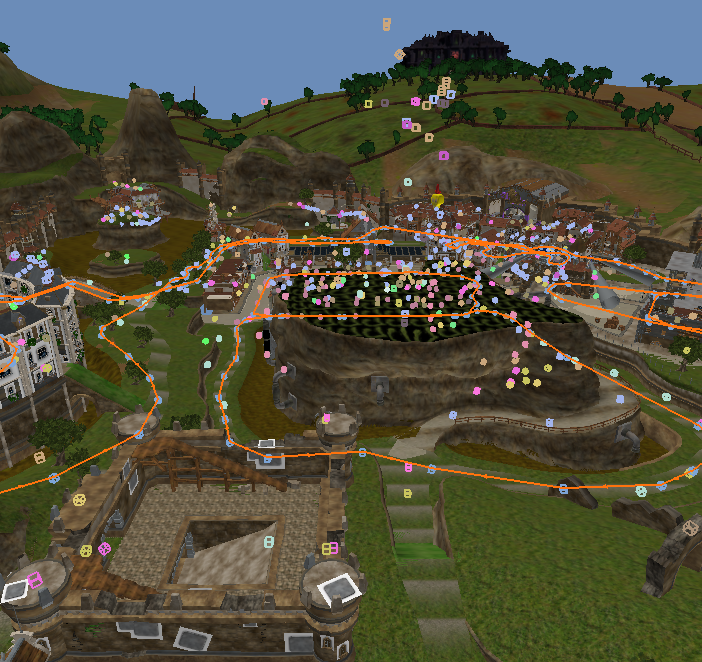
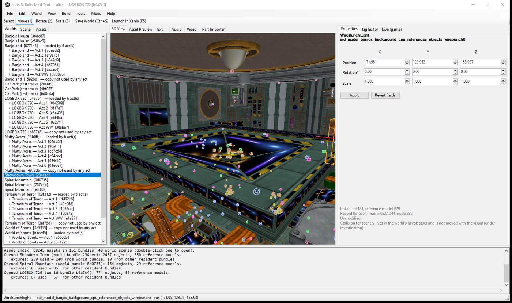
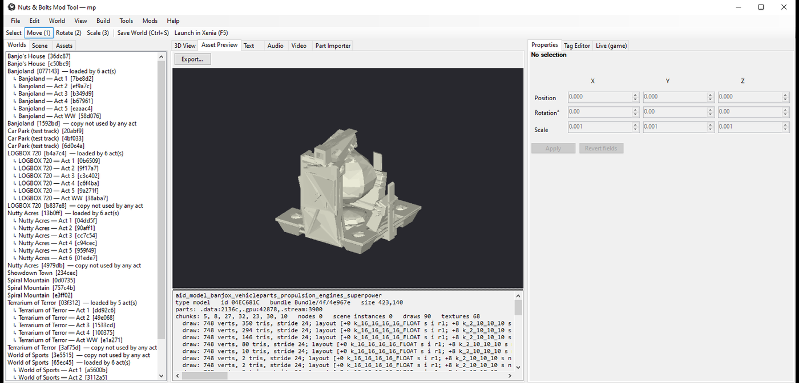
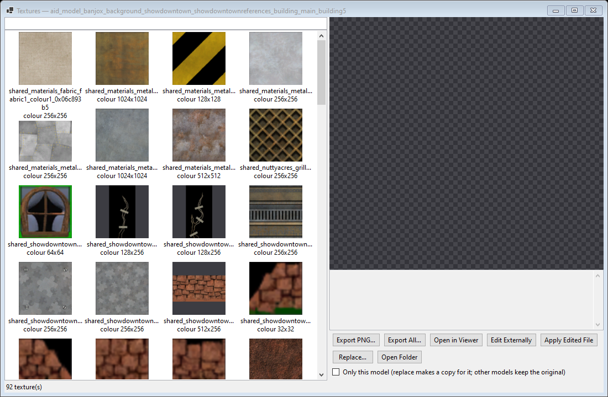

<p align="center">
  
</p>

<p align="center">
  <b>A world editor and modding toolkit for <i>Banjo-Kazooie: Nuts &amp; Bolts</i> (Xbox 360).</b><br>
  Open the game's worlds in 3D, move and replace scenery, swap textures, import models and vehicle parts,
  edit text, audio and video, and share your changes as small patches that anyone can apply to their own copy.
</p>

<p align="center">
  
  
  
  
</p>

---

## Contents

- [What it does](#what-it-does)
- [Screenshots](#screenshots)
- [Installation](#installation)
- [Tutorial: your first mod](#tutorial-your-first-mod)
- [How the tool works](#how-the-tool-works)
- [Research: the game's file formats](#research-the-games-file-formats)
- [Building from source](#building-from-source)
- [Related: NB Multiplayer](#related-nb-multiplayer)
- [Credits and legal](#credits-and-legal)

---

## What it does

| Area | What you can do |
|---|---|
| **Worlds** | Open every world and Act (Showdown Town, Nutty Acres, LOGBOX 720, Banjoland, Terrarium of Terror, Spiral Mountain, World of Sports, the test track...) with terrain, scenery, markers, AI paths and collision. Select, move, rotate, scale, duplicate and delete objects with undo/redo. |
| **Models** | Preview any model in 3D, export to OBJ or FBX (with skeleton and skin for characters), import OBJ/FBX geometry to replace scenery, build new scenery from imported models. |
| **Textures** | Decode all 14,049 textures (DXT1/3/5, DXN, CTX1, ARGB, cube and volume maps), browse a model's or world's textures in the texture library, export PNG, replace with your own image. |
| **Collision** | View and import world collision (Havok 5.5 extended meshes); box collision for imported scenery. |
| **Markers & paths** | Edit actor spawns, pickups, volumes, script triggers and AI path routes (the race paths the computer drivers follow). |
| **Vehicle parts** | Part Importer: build new garage parts (model, physics, stats, attach points, garage tier dialogs). |
| **Text, audio, video** | Edit in-game text in all languages, replace music and sound effects (XWB banks), replace videos. |
| **Executable mods** | Toggle researched game-code changes (e.g. vehicles in town, debug menus) as Xenia patches or baked into the executable. |
| **Testing** | Launch your modded game in Xenia with one key (F5), and tweak a running game live (teleport, gravity, camera). |
| **Sharing** | Export a `.nbpatch`: a small differential patch with only your changes. It contains no game data, and others apply it to their own copy with one click (with backup and rollback). |

Everything is non-destructive: NB Studio works on a **workspace** (a copy of your game), never on your original files,
and keeps a history of every saved file.

## Screenshots

<p align="center">
  
  
</p>
<p align="center"><i>Start page, and Showdown Town opened in the world editor (terrain, scenery, markers and the AI race route).</i></p>

<p align="center">
  
</p>
<p align="center"><i>The 3D view: every coloured box is a marker (pickups, actor spawns, triggers); the orange line is the AI path network.</i></p>

<p align="center">
  
  
</p>
<p align="center"><i>Editing LOGBOX 720 scenery with exact numeric transforms, and previewing a vehicle part model with its draw calls and vertex layouts.</i></p>

<p align="center">
  
</p>
<p align="center"><i>The texture library of a Showdown Town building: export, replace, or edit externally and re-apply.</i></p>

## Installation

1. **Download** the latest `NB-Studio-x.y.z.zip` from the [Releases](../../releases) page and unzip it anywhere.
2. You need **your own copy of the game**, extracted to a folder: the folder that contains `default.xex` and the
   `Bundle` folder (for example extracted from your disc image with *extract-xiso*). NB Studio never changes this folder.
3. Run **`NBModStudio.exe`**. Requirements: Windows 10/11 64-bit, a GPU with OpenGL 3.3.
4. For testing your mods, install **[Xenia Canary](https://github.com/xenia-canary/xenia-canary)** and point NB Studio
   to it the first time you press **Launch in Xenia (F5)**.

## Tutorial: your first mod

**1. Create a workspace.** On the start page choose *New Workspace from Game Directory...*, pick your game folder, then
an empty folder for the workspace. NB Studio copies the game there (a few minutes, about 7 GB) and indexes its 69,000
assets.

**2. Open a world.** The *Worlds* list shows every world and Act. Double-click **Showdown Town**. The 3D view opens:
right-drag to look around, WASD/QE to fly (Shift = fast), mouse wheel to dolly, middle-drag to pan, F to focus the selection.

**3. Move something.** Click a piece of scenery (for example a café table near Mumbo's Motors). Press **Move (1)** and
drag the arrows, or type exact numbers in *Properties* and press *Apply*. Rotate (2) and Scale (3) work the same way.
Ctrl+Z undoes.

**4. Change a texture.** Right-click the object and choose *Textures... (view / export / replace)*. The texture library shows every texture the
model uses (*World > Texture Library* shows every texture of the world). Select one, *Export PNG*, paint over it, then *Replace...* with your image (tick *Only this model* to
leave other models that share the texture alone).

**5. Import a model.** Right-click scenery, *Import Model (replace geometry with OBJ/FBX)...*, pick an OBJ or FBX. It
replaces the object's model, importing the file's materials and textures. For collision use *Import Collision
(OBJ/FBX)...*.

**6. Save and test.** *Save World (Ctrl+S)* writes the changed bundle into your workspace. *Launch in Xenia (F5)*
starts the game from the workspace. *Tools > Test Mode: Skip Intro* makes a new game start straight in Showdown Town (about 40
seconds from launch).

**7. Share it.** *Build > Create Distributable Patch (.nbpatch)...* writes a `.nbpatch`. Other players apply it with
*Build > Apply Patch to a Game Directory...* (it checks their files first and keeps a backup; *Roll Back Patches* undoes it), or play it online with friends as an *edition* in
[NB Multiplayer](https://github.com/weighta/NB-Multiplayer).

## How the tool works

```
NBModTool.sln
├── src/NB.Core         format library: xcompress, CAFF, bundles, textures, models, markers, scripts, collision,
│                       animations, text, audio, executable, workspace, patches, room server (multiplayer)
├── src/NB.Studio       the desktop editor (WinForms + OpenGL 3.3)
├── src/NB.Cli          command-line tools (over 100 commands: extraction, round-trip tests, batch edits)
└── src/NB.Multiplayer  the NB Multiplayer app (WPF), see the NB Multiplayer repository
docs/FORMATS.md         the file-format reference (summary below)
docs/STATUS.md          what is verified, what works, what is experimental
docs/research/          deep dives: garage, destruction, camera, debug menus, draw distance, animation codec...
research-tools/probe/   the Python scripts used to work the formats out
```

**Reading.** The game's 151 resident bundles (`Bundle/4f`, most xcompress/LZX-compressed) are decompressed in memory
into CAFF containers; streamed data (`Bundle/50`) is read from archives on demand. Every asset (69,000 of them) is
indexed by id, name, type and bundle; ids are a CRC-32 of the name, so a name always tells you where to look.

**Editing.** Every edit goes through the same path: parse the asset, change it, rebuild the CAFF (parts re-aligned,
relocation tables regenerated, checksum recomputed) and write the bundle back **uncompressed**. The game loads
uncompressed bundles fine, so no recompression is needed. Each save is recorded in the workspace's change log and history
(undo per file, revert to original).

**Sharing.** A `.nbpatch` holds binary deltas (COPY/ADD operations) of each changed file against the expanded
original, plus the SHA-256 of the expected source and result. Applying verifies both, so a patch only ever applies to the
exact game files it was made for, and never distributes game data.

**Testing.** Xenia runs the workspace's game directory; executable mods are written as Xenia patch files (or baked into
`default.xex` for consoles that run unsigned code). The *Live (game)* tab attaches to a running Xenia and reads/writes
guest memory for teleporting, gravity and photo-mode camera control.

## Research: the game's file formats

Everything here was established against the unmodified game and is documented in full in
**[docs/FORMATS.md](docs/FORMATS.md)** (1,100+ lines), with deep dives in **[docs/research](docs/research)** and the
verification status of every feature in **[docs/STATUS.md](docs/STATUS.md)**. All values are big-endian (PowerPC).
Items are marked **[verified]** (checked on every file of that kind, or in Xenia), **[observed]** or **[unknown]**.

### Game directory and ids
| Path | Contents |
|---|---|
| `default.xex` | XEX2 executable (AES-encrypted, basic-compressed) |
| `Bundle/4f/<id>` | 151 resident bundles, one CAFF each (142 xcompress-compressed) |
| `Bundle/50/<id>` | 151 streaming archives (CAFFs and XACT wave banks loaded on demand) |
| `Debug/11`, `loctext/` | localised text (CAFF) |
| `Debug/36` | videos (WMV/ASF) |

An asset id is `typeByte << 24 | (CRC32(name) & 0xFFFFFF)` (reflected CRC-32, init `0xFFFFFFFF`, **no** final
inversion), where the name drops the `aid_<type>_` prefix. Bundles are named the same way: `banjox_common` is
`0x685374`, so its files are `Bundle/4f/685374` and `Bundle/50/685374`. Over 45 asset type bytes are mapped (texture
01, anim 02, model 04, havok 05, marker 0D, script 19, objparams 1F, challenge 3D...).

### Containers
* **xcompress `0x0FF512ED`**: LZX blocks (what `xbdecompress` undoes); decoded natively by NB.Core.
* **CAFF**: header with checksum, symbol table (asset names), parts grouped in sections (`.data`, `.gpu`, `.stream`,
  `.texturegpu`, `.gpucached`...), and a relocation table listing every pointer (pointers are stored as offsets into
  the target part). Rebuilding regenerates all of it: **1,756/1,756 files round-trip byte-identically**.
  Each bundle has a `manifest` asset listing (asset id, ordinal) pairs and the **dependency bundles**; the game finds
  assets only through the manifest, and a level's bundle pulls in its world through these dependencies.
* **Streaming archive `0x438CB47C`** (Bundle/50): entry table (asset id, offset, size) and dependencies; **151/151
  round-trip**.

### Textures **[verified on all 14,049]**
The CPU part holds the XDK `D3DFORMAT` (GPU format, endian swap, tiled bit), kind (2D, cube, multi-frame, volume),
size, level count and pointers to the GPU data. A texture is usually two assets: `...mip` (resident, levels 1..n) and
`...top` (streamed from Bundle/50, level 0). Formats in use: DXT1 (9,382), DXN (2,141), DXT3, CTX1, DXT5, 8-bit and
ARGB8888. Tiled data uses the Xbox 360 32×32-block macro tiles with 4 KB-aligned levels and a packed mip tail; linear
data pads rows to 256 bytes. DXN and CTX1 are two-channel normal maps. Replacement writes both the `mip` and the `top`.

### Models
`.data` begins with a chunk table of `(id, pointer)` pairs:
* **Chunk 2: nodes.** Transforms and parents (68 bytes each). In characters they bind skin; in worlds they are the
  scenery placements.
* **Chunk 12: scenery instances.** Each references a model by id, with a 0x144-byte record (name like
  `|REFERENCE_crate1|`), a world matrix and position. Moving scenery means editing these.
* **Render resources.** Vertex and index buffers (`.gpu`), shader patch lists into the bundle's shared `pool` asset,
  and a **command stream** (`.stream`) of draw commands: set shaders, bind vertex buffer, bind textures (into the
  model's texture table), constants, draw indexed, with LOD levels.
* **Vertex layout** is not stored with the mesh: it is read from the *vfetch* instructions of the vertex shader
  microcode in the pool (position float3/half4, normals 10:10:10:2, half2 UVs, skin indices/weights...).
* **Skeleton and skinning [verified in Blender]**: the `pose` object (52 bytes per joint: translation, bind pose,
  quaternion, parent/child/sibling/mirror links). Banjo has 175 joints, Mumbo 127, Grunty 119.
* **Animations [decoded, all 5,911]**: `QUAT_BITSTREAM`/`BITSTREAM` keyframe codec (per-channel base and bit width,
  LSB-first bit reading, w reconstructed). NB Studio exports to FBX and re-encodes edited animations.

### Markers **[26,943 records parse exactly]**
`aid_marker_*` assets hold every placed thing that is not scenery: actor spawns, pickups and indicators, volumes,
script triggers, gated collectables, path nodes... Records have a fixed size per type:
```
+0x00 u32 size   +0x04 u16 type   +0x06 u16 index   +0x08..0x13 [flags/links]
+0x14 float3 position   +0x20 float3 rotation (radians)   +0x2C float scale
+0x30... type-specific payload: asset ids (objparams 0x1F..., scripts 0x19...), enum strings
```
**Path nodes** (type 22) link to the next node through the u16 at +8; Showdown Town's AI route is 331 nodes along the
roads. Worlds load the world's own marker set plus one set per Act (`aid_marker_<world>_act<N>_main`).

### Scripts, levels and objects
* **Scripts** (`aid_script_*`): a header and a flat list of fixed-size commands `(size, opcode, args)`, no pointers,
  so commands can be added or removed (702/702 parse). Known opcodes include load level geometry (0x01), load marker
  sets (0x4E), skydome (0x2C), run sub-script (0x52/0x5A), set game flag (0x48), start challenge (0x60) and go to level
  (0x86). The script header names the bundle a level loads.
* **Objparams** (type 0x1F) store actor and vehicle-block parameters (layouts inferred from all 1,810 assets).
* **Vehicles** (type 0x00): a header plus one 0x24-byte record per block (grid position, category, part objparams id,
  rotation, paint, action button), all 275 parse exactly.

### Collision **[decoded]**
`aid_havok_*` wraps a **Havok 5.5.0-r1 binary packfile**; world collision is an extended mesh whose index and vertex
buffers are stored next to the packfile (Showdown Town: 67,576 triangles in one subpart, 367,474 overall). NB Studio
draws it and can import new collision meshes.

### Executable
`default.xex` decrypts with the retail key to a PE image. Researched code locations power the *Executable mods* list:
vehicles in town, debug menus and recovered parts (see `docs/research`).

## Building from source

Requirements: Windows 10/11, the [.NET 9 SDK](https://dotnet.microsoft.com/download).

```bash
git clone https://github.com/weighta/NB-Studio-Banjo-Kazooie-Nuts-and-Bolts-World-Editor-.git
cd NB-Studio-Banjo-Kazooie-Nuts-and-Bolts-World-Editor-
dotnet build NBModTool.sln -c Release
```

The editor is `src/NB.Studio/bin/Release/net9.0-windows/NBModStudio.exe`, and the command-line tool is
`src/NB.Cli/bin/Release/net9.0-windows/NB.Cli.exe` (run it without arguments for the command list).

## Related: NB Multiplayer

Play Nuts & Bolts online with friends, including games modded with NB Studio:
**[weighta/NB-Multiplayer](https://github.com/weighta/NB-Multiplayer)**. Its app is built from `src/NB.Multiplayer` in
this repository.

## Credits and legal

* Created by **weighta**.
* Texture tiling follows the [Xenia](https://github.com/xenia-project/xenia) project's documentation of the Xbox 360
  GPU; audio decoding uses [vgmstream](https://github.com/vgmstream/vgmstream).
* NB Studio is licensed under the [MIT license](LICENSE).
* *Banjo-Kazooie: Nuts & Bolts* is © Microsoft and Rare. This is an unofficial fan project, not affiliated with or
  endorsed by them. It contains no game data; you need your own copy of the game.
